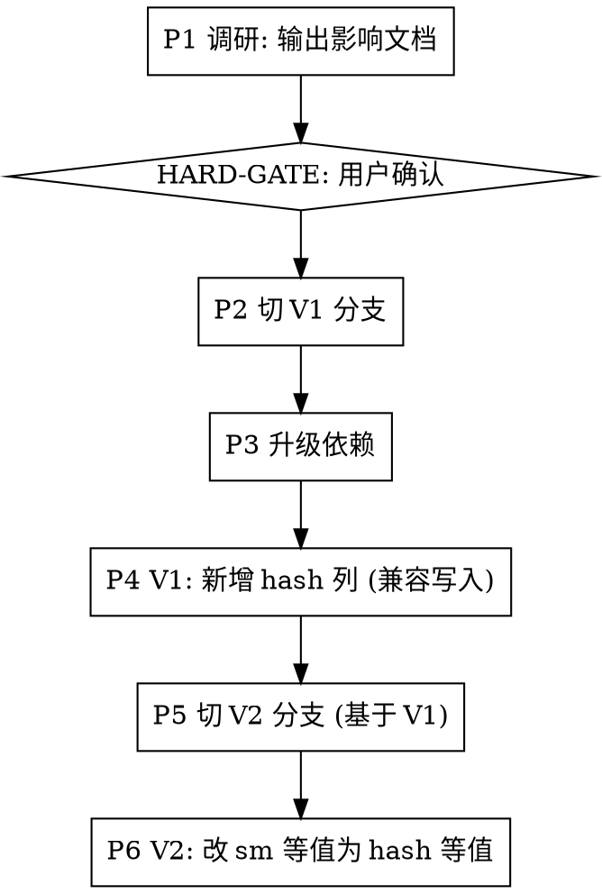

# PCI 密钥轮换：xxx_sm → xxx_hash 迁移

## 背景

SxfAksUtils 加密库升级（PCI 密钥轮换）后，同一明文加密两次会得到**不同密文**（但都能解密）。
因此所有以 `_sm` 密文做等值匹配的代码（Java `.equals()` / SQL `WHERE xxx_sm = ?`）都会失效。

**解决方案**：为每个 `xxx_sm` 增加一列 `xxx_hash`（HMAC-SHA256），将"密文等值"改为"hash 等值"。

## 命名与依赖约定

| 项 | 值 |
|----|----|
| 加密列后缀 | `_sm`（SM4 密文） |
| 掩码列后缀 | `_mask`（脱敏展示） |
| **新增 hash 列后缀** | `_hash`（HMAC-SHA256，等值查询） |
| Hash 工具类 | `com.cogo.digest.QueryDigestUtil` |
| 明文 → hash | `QueryDigestUtil.digestFromPlain(plain)` |
| 密文 → hash | `QueryDigestUtil.digestFromCipher(cipher)` |
| 升级依赖 | `com.cogolinks:cogo-metric-core:2.4.5-test-SNAPSHOT` |

## 工作流总览（6 阶段）



**铁律**：
- P1 完成必须 HARD-GATE 等用户确认（对齐 R8）。
- V1 做"加列 + 写入兼容 + XML 预留 hash 的 `<if>`"，但**不动任何 Java 比较逻辑、不动 Service 入参**——XML 中新加的 `xxx_hash` `<if>` 因为没人传参所以不会拼出，行为零变更。
- V2 才把 Java `_sm` 等值比较切到 `_hash`，并把 Service 入参从 `setXxxSm` 切到 `setXxxHash`。XML 在 V1 已完工，V2 不再动 XML。

---

## Phase 1 · 调研：输出影响文档

**目标**：盘清楚本仓库受影响的所有 `_sm` 字段、所在表、Java/XML 中的等值比较点、控制器→服务→Mapper 调用链。

**输出文件**：`docs/pcihash/<YEAR>-PCI密钥轮换影响.md`（不创建任何其他文档文件，遵循 R6）。

**模板**：

```markdown
# <YEAR>-PCI 密钥轮换影响清单

## 一、_sm 字段清单
| 表名 | 字段 |
|------|------|
| `t_xxx_xxx` | `a_sm`, `b_sm` |
| `t_yyy_yyy` | `c_sm` |

## 二、等值/包含比较点（V2 需改）
| 文件 | 行号 | 形式 | 待改 |
|------|------|------|------|
| `XxxServiceImpl.java` | 42 | `s.getASm().equals(req.getASm())` | → `getAHash().equals(digestFromPlain(...))` |
| `XxxMapper.xml` | 88 | `AND a_sm = #{aSm}` | → `AND a_hash = #{aHash}` + 保留 `_sm` if |

## 三、调用链
| 入口功能（一句话） | 调用链 |
|--------------------|--------|
| 黑名单列表分页查询 | Controller `/api/xxx/search` → `XxxServiceImpl#search` → `XxxMapper#search`（使用 `a_sm` 等值） |
| 新增黑名单时按账号验重 | Controller `/api/xxx/add` → `XxxServiceImpl#add` → `XxxMapper#accurateQuery`（使用 `a_sm` 验重） |
| 支付路由命中黑名单内存过滤 | Handler `CheckXxxHandler#handle` → 内存中 `.equals(getASm())` 比较 |

## 四、风险与上线动作
- **V1 期间 hash 与 sm 双写**：所有写入路径（add / batchInsert / updateById / batchUpdate / Job 同步）同时回填 `_hash` 与 `_sm`，新数据 hash 不会为空。
- **V1 上线后必须补刷历史数据**：执行一次性回填脚本，把存量 `xxx_sm` 解密后计算 hash 写入 `xxx_hash`。补刷完成是 V2 上线的**前置条件**。
  ```sql
  -- 示意：实际由应用侧跑批（需调用 SxfAksUtils.decrypt + QueryDigestUtil.digestFromPlain）
  UPDATE t_xxx_xxx
     SET a_hash = <HMAC(decrypt(a_sm))>
   WHERE a_sm IS NOT NULL AND a_hash IS NULL;
  ```
- **回滚预案**：V2 上线后若 hash 命中异常，可回退到 V1——XML 中 `_sm` 的 `<if>` 仍保留，老调用方传 SM 仍可工作。
```

**搜索命令模板**：
```bash
# 1. 找所有 _sm 字段（XML + Java）
grep -rEn '\b\w+_sm\b' --include='*.xml' --include='*.java' -- <repo>

# 2. 找 Java 等值/包含/查找类比较（穷举常见方法名，避免漏网）
#    覆盖：equals / equalsIgnoreCase / equalsAny / equalsAnyIgnoreCase
#         contains / containsIgnoreCase / containsAny
#         indexOf / lastIndexOf / startsWith / endsWith
#         Objects.equals / StringUtils.equals*
grep -rEn '\.get\w+Sm\(\)\s*\.\s*(equals|equalsIgnoreCase|equalsAny|equalsAnyIgnoreCase|contains|containsIgnoreCase|containsAny|indexOf|lastIndexOf|startsWith|endsWith)\s*\(' --include='*.java' -- <repo>
# 反向：把 SM 当参数传给上述方法
grep -rEn '\.(equals|equalsIgnoreCase|equalsAny|equalsAnyIgnoreCase|contains|containsIgnoreCase|containsAny|indexOf|lastIndexOf|startsWith|endsWith)\s*\([^)]*\.get\w+Sm\(\)' --include='*.java' -- <repo>
# 工具类静态比较：Objects.equals(xxxSm, ...) / StringUtils.equals*(xxxSm, ...)
grep -rEn '(Objects|StringUtils)\.\w*[Ee]quals\w*\s*\([^)]*\.get\w+Sm\(\)' --include='*.java' -- <repo>
# Collection.contains(xxxSm) —— sm 作为单参传入
grep -rEn '\.contains\s*\(\s*\w+\.get\w+Sm\(\)\s*\)' --include='*.java' -- <repo>

# 3. 找 SQL 中以 _sm 字段做条件的语句（等值 / IN / LIKE）
grep -rEn '(?i)(and|where|on)\s+\w*\.?\w+_sm\s*(=|in|like)' --include='*.xml' -- <repo>
```

**人工兜底**：上述 grep 只能覆盖常见模式，**必须**再人工通读 P1 清单里每个 `_sm` 字段所在 PO 的 `getXxxSm()` 调用链（IDE Find Usages），把任何"两个 `_sm` 值进行比较 / 判断"的位置全部记入 P1 文档第二节，**漏一处 = V2 上线某条路径直接失效**。

**Phase 1 完成后 STOP**：把影响文档路径报告给用户，明确请求"是否开始 P2 切分支并执行 P3–P6"。**禁止自作主张继续**（对齐 R8 HARD-GATE / R10 执行阶段零自由度）。

---

## Phase 2 · 创建 V1 分支

- 创建新分支，命名：`BR_<YYYYMMDD>_pci_ask_hash_v1`（日期取用户给定或当前日期）。

```bash
git checkout -b BR_<DATE>_pci_ask_hash_v1
```

---

## Phase 3 · 升级依赖

定位每个 `build.gradle`（或 `pom.xml`）中 `com.cogolinks:cogo-metric-core` 的引用，统一改为：

```gradle
implementation 'com.cogolinks:cogo-metric-core:2.4.5-test-SNAPSHOT'
```

若项目中**没有**该依赖，则在主 data/core 模块的 `build.gradle` 添加。
依赖锁定使用确定版本号，禁止 `latest` / `+`（对齐 R5）。

---

## Phase 4 · V1：新增 hash 列、写入兼容、XML 预留 hash `<if>`

针对 P1 清单中的每一个 `xxx_sm`，按以下 4 个动作改造：

### 4.1 ALTER SQL

每张表一个文件：`docs/pcihash/<table_name>.sql`

```sql
ALTER TABLE `<db>`.`<table>`
  ADD COLUMN `xxx_hash` varchar(512) NULL COMMENT 'xxx-hash' AFTER `xxx_sm`;
```

多字段在同一文件按顺序列出，每个 `AFTER` 紧跟对应 `_sm`。

### 4.2 Domain (PO) 新增字段

在 PO 中追加（保持 `@Data`、Lombok 风格不变）：

```java
@Schema(description = "xxx-hash")
private String xxxHash;
```

### 4.3 Mapper XML：写入路径全覆盖

**必须**同时修改以下所有出现位置，缺一会导致 hash 列空：

| 位置 | 改造 |
|------|------|
| `<resultMap>` | 增加 `<result column="xxx_hash" property="xxxHash"/>` |
| 公共字段列 `<sql id="...">` | 增加 `xxx_hash,` |
| `insert` / `add` | 列名 + values 两处 |
| `updateById` 的 `<set>` | 增加 `<if test="xxxHash != null">xxx_hash = #{xxxHash},</if>` |
| `batchInsert` | columns + values + `ON DUPLICATE KEY UPDATE` 三处 |
| `batchUpdate` | `<set>` + （如有）`<foreach>` |
| `select` / `search` / `dynamicWhere` 等查询语句 WHERE | **新增** `<if test="xxxHash != null and xxxHash != ''">AND xxx_hash = #{xxxHash}</if>`，与原有 `xxx_sm` 的 `<if>` **并列保留** |

**注意**：
- P4 阶段对 WHERE 的策略是**只加不删**：把 `xxx_hash` 的 `<if>` 块加进去，但原 `xxx_sm` 的 `<if>` 块**绝对保留**——V1 期间没人传 `xxxHash` 参数，新加的 `<if>` 不会拼出，行为完全等价于改造前；这样 V2 阶段无需再回头改 XML。
- Request DTO 在 P4 也要同步加 `xxxHash` 字段，确保 MyBatis OGNL `xxxHash != null` 不会抛 "no getter" 异常。
- select 列默认通过公共 `<sql>` 覆盖，不必每条 select 单独加列。

### 4.4 写入逻辑：补 hash

在每个写入 PO 的地方，**保留原 `setXxxSm()` 不变**，紧随其后补一行：

```java
// 兼容写入：补 xxx_hash（用于后续等值查询）
po.setXxxHash(QueryDigestUtil.digestFromCipher(po.getXxxSm()));
```

如果当前上下文已经有明文（典型如 `add` 入口），优先用更便宜的 `digestFromPlain`：

```java
// 入参带明文：先算 hash 再加密，避免重复解密
req.setXxxHash(QueryDigestUtil.digestFromPlain(req.getXxx()));
req.setXxxSm(SxfAksUtils.encrypt(req.getXxx()));
```

**自检**：所有写入路径（add / batchInsert / updateById / batchUpdate / Job 同步）都要补；没有写入路径的只读表跳过。

### 4.5 Phase 4 验证（R12）

- 编译通过：`./gradlew :<module>:compileJava`
- 跑一遍受影响 Mapper 的单测（若有）
- 把 P1 清单中所有"修改文件"逐一 checklist 勾选

---

## Phase 5 · 创建 V2 分支（基于 V1）

```bash
git checkout BR_<DATE>_pci_ask_hash_v1
git checkout -b BR_<DATE>_pci_ask_hash_v2
```

V2 必须基于 V1（不是基于 master），否则会丢掉 hash 列的写入兼容。

---

## Phase 6 · V2：切等值查询到 hash

**前提**：P4 已在 XML 中**并列加上** `xxx_hash` 的 `<if>`，并在 Request DTO 中加好 `xxxHash` 字段。所以 V2 阶段**不再动 XML、不再动 DTO**，只改两类代码：

1. **Java 内存比较**：所有 `xxxSm.equals(yyySm)` / `Collection.contains(xxxSm)` / `Objects.equals(xxxSm, ...)` 等改为 hash 比较。
2. **Service 查询入口**：把"加密后塞 `setXxxSm`"改为"hash 后塞 `setXxxHash`"——由于 XML 中 `_sm` 的 `<if>` 仍在但 `xxxSm` 不再被 set，条件不会拼出；新设的 `xxxHash` 走 hash 条件。

**hash 来源选择**：
- 入参带明文 → `QueryDigestUtil.digestFromPlain(plain)`
- 上下文只有密文 → `QueryDigestUtil.digestFromCipher(cipher)`

### 6.1 Java 比较改造模板

**改前**：
```java
boolean hit = StringUtils.isEmpty(s.getAccountNoSm())
        || s.getAccountNoSm().equals(businessOrder.getAccountNoSm());
```

**改后**：
```java
// 改用 hash 比较，避免直接对比 SM 密文（同明文不同密文时可能误判）
boolean hit = StringUtils.isEmpty(s.getAccountNoHash())
        || s.getAccountNoHash().equals(QueryDigestUtil.digestFromCipher(businessOrder.getAccountNoSm()));
```

### 6.2 Service 查询入口改造模板

**改前**：
```java
req.setAccountNoSm(SxfAksUtils.encrypt(req.getAccountNo()));
```

**改后**：
```java
// 改用 hash 等值查询，不再传入 SM 密文
req.setAccountNoHash(QueryDigestUtil.digestFromPlain(req.getAccountNo()));
```

> **注意**：不要保留原 `setAccountNoSm(...)`——保留会让 XML 同时拼 `account_no_sm = ?` 和 `account_no_hash = ?` 两个条件，老 SM 密文又匹配不上，直接查空。

### 6.3 Phase 6 验证（R12）

- 全量 `./gradlew compileJava`
- 受影响接口手工 / curl 验证：相同明文新老密文都能命中查询
- 黑名单 / 规则命中类逻辑：构造一个新加密的密文，确认仍能被命中

---

## 常见陷阱（必看）

| 陷阱 | 后果 | 防御 |
|------|------|------|
| V1 阶段顺手把 Service 入参从 `setXxxSm` 切成 `setXxxHash` | 灰度期老数据 hash 还没补刷 → 命中率骤降 | V1 **只加 XML 的 hash `<if>` 和 DTO 字段**；切入参放 V2，且 V2 前必须完成历史补刷 |
| V1 阶段把 XML 中 `xxx_sm` 的 `<if>` 删掉 | 回滚预案失效，老调用方传 SM 立刻查空 | 只**加**不**删**——`_sm` 和 `_hash` 两个 `<if>` 并列长期共存 |
| `batchInsert` 的 columns / values / ON DUPLICATE 三处只改一处 | INSERT 列数不匹配或 hash 不写入 | 用 grep `batchInsert` 定位三个锚点逐一验证 |
| `digestFromPlain` 和 `digestFromCipher` 用混 | hash 值对不上 → 永远 miss | 入参有明文用 plain；只有密文用 cipher，并加注释 |
| XML 编辑时贪婪匹配带走相邻 `<if>` | 其他 where 条件失效 | Edit `old_string` 取**最小**唯一上下文，验证 diff |
| 漏改写入路径 (Job、批量同步) | 历史数据 hash 永远空 | 在 P1 调研阶段穷举所有 `setXxxSm` 调用点 |
| V2 切完入参后忘记**移除**原 `setXxxSm()` | XML 同时拼 sm 和 hash 两个等值条件 → 老密文不匹配查空 | 见 6.2 "注意" |
| P4 加 XML hash `<if>` 但忘记给 DTO 加 `xxxHash` 字段 | MyBatis OGNL `xxxHash != null` 抛 "no getter" | 4.3 表格末行强制清单 |

## 红色信号 - 立刻停下

- "我先把 P1 调研和 P4 改造一起做了" → 违反 HARD-GATE
- "V1 我把 WHERE 也顺手改了，反正一起" → 破坏灰度
- "这个表只有 select，应该不用补 hash" → 仍需补，可能被其他模块 INSERT
- "找不到 `QueryDigestUtil`" → 依赖 P3 没升级到位

## 输出规范（每阶段）

- **P1 完成**：贴出 `docs/pcihash/<YEAR>-PCI密钥轮换影响.md` 路径 + 字段汇总表，**等用户放行**
- **P2/P3/P4 完成**：贴当前分支名 + 修改文件列表 + 编译输出
- **P5/P6 完成**：贴当前分支名 + diff 摘要 + 跑过的验证证据（编译 / curl / 日志）

所有阶段对话语言：中文（对齐 R6）。所有新增 Java 字段、方法、关键逻辑：中文注释（对齐 R7）。
